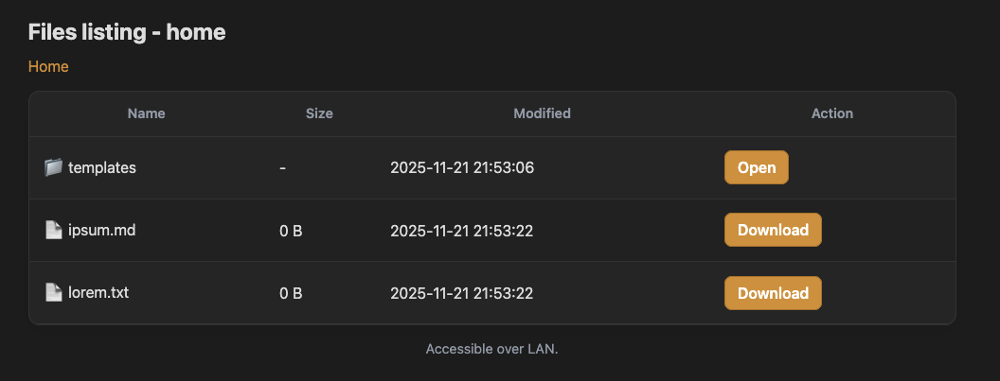
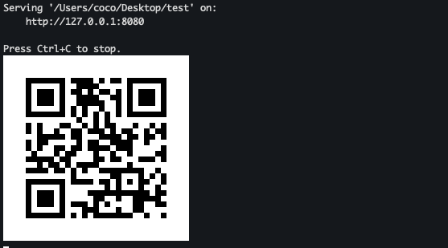
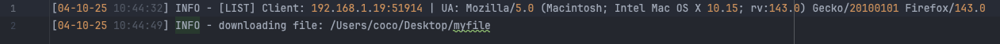

# file-serve

Transfer files unidirectionally via LAN, pointlessly written in rust with [axum](https://docs.rs/axum/latest/axum/).

---

## Usage
- Run the executable.
```
Usage: file-serve [OPTIONS]

Options:
  -p, --port <P>       Server port, defaults to 8080.
  -f, --folder <f>     Folder to be served, default is current folder.
  -i, --interface <i>  Interface to bind, default is first occurring interface.
  -h, --help           Print help
  -V, --version        Print version
```

- Navigate to bound link. 

The webpage will show as follows:


Running from a terminal emulator shows the output:


In the same executable folder a log file will be created:


**The software is not intended for production environment.**

---

## Build from source

1. Install the Rust toolchain using [rustup](https://rustup.rs/).

2. Clone the repo.
   ```
   git clone https://github.com/ctrlcoco/file-serve.git
   cd file-serve
   ```
3. Build the program.
   ```
   cargo build --release
   ```
---

## TO-DO
- Better system integration.
- Make an entire folder downloadable.

## Reporting a Vulnerability

If you want to disclose a vulnerability, 
please email to [cocosoftware8@gmail.com]("mailto:cocosoftware8@gmail.com?subject=Vulnerability")
